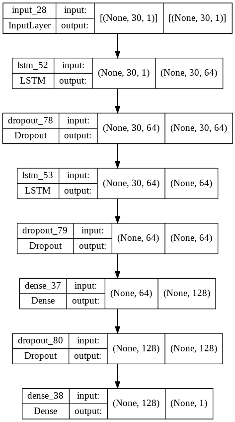
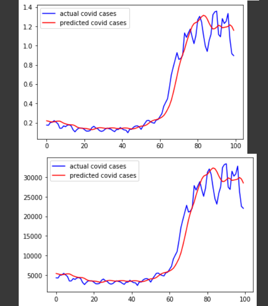
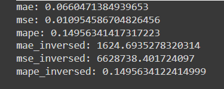
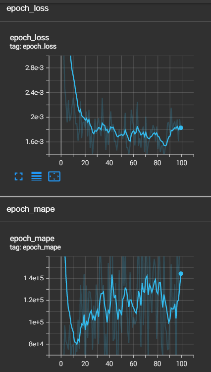

# COVID19-cases-prediction

## Description
The year 2020 was a catastrophic year for humanity. Pneumonia of unknown aetiology was first reported in December 2019., since then, COVID-19 spread to the whole world and became a global pandemic. More than 200 countries were affected due to pandemic and many countries were trying to save precious lives of their people by imposing travel restrictions, quarantines, social distances, event postponements and lockdowns to prevent the spread of the virus. However, due to lackadaisical attitude, efforts attempted by the governments were jeopardised, thus, predisposing to the wide spread of virus and lost of lives.
The scientists believed that the absence of AI assisted automated tracking and predicting system is the cause of the wide spread of COVID-19 pandemic. Hence, the scientist proposed the usage of deep learning model to predict the daily COVID cases to determine if travel bans should be imposed or rescinded.

Hence, in this project, our aim is to create a deep learning model using LSTM neural network which will be used to predict new cases (cases_new) in Malaysia using the past 30 days of number of cases.

# Our Aproach

# Step 1) Loading the data:
Data preparation is the primary step for any deep learning problem. The dataset can be obtained from this link [github](https://github.com/MoH-Malaysia/covid19-public). This project will be use two types datasets that contain covid cases which one will be use for train the model and the other is for testing the model.

           COVID_PATH = os.path.join(os.getcwd(),'cases_malaysia_train.csv')
           COVID_TEST_PATH = os.path.join(os.getcwd(),'cases_malaysia_test.csv')

           df = pd.read_csv(COVID_PATH,na_values = [' ','?'])
           test_df = pd.read_csv(COVID_TEST_PATH,na_values = ' ')

# Step 2) Data Inspection/Visualization:

           df.head(10)
           df.tail(10)
           df.info()
           df.describe()
           
Here, we would like to focus more on new cases of COVID-19 and to see the trend of the transmission.

           plt.figure()
           plt.plot(df['cases_new'])
           plt.legend(['cases_new'])
           plt.show()

           df.duplicated().sum()  
           df[df.duplicated()]

# Step 3) Data Cleaning:

From the previous step, we noticed that our datasets have contains number of duplicates. Thus, remove the duplicated data are necessary.

           # Remove the duplicated data
           df = df.drop_duplicates()
           df.duplicated().sum()   # Ensure all duplicated have been removed

Then, `.interpolate()` will be use to impute the NaN values.

           df = df['cases_new'].interpolate() 
           df.isna().sum()
           df = pd.DataFrame(df)

           
# Step 4) Preprocessing:

           mms = MinMaxScaler()
           df = mms.fit_transform(np.expand_dims(df['cases_new'],axis=-1))
           test_df = mms.transform(np.expand_dims(test_df['cases_new'].values,axis=-1))

           X_train = []
           y_train = []

           win_size = 30 # since, we are predicting the next 30 days

           for i in range(win_size,np.shape(df)[0]): #or df.shape[0]
             X_train.append(df[i-win_size:i,0]) 
             y_train.append(df[i,0]) # i because to predict the next day, '30'

           X_train = np.array(X_train)
           y_train = np.array(y_train)

# Model Development
By using the model Sequential, LSTM, dropout, and Dense, Our model development is been structured. The model function can be view in `module_covid_cases.py` file.

           mc = ModelCreation()
           model = mc.model_development(X_train, num_node=64, drop_rate=0.2, 
                                        output_node=1)

           model.compile(optimizer='adam',loss='mse',metrics='mape')

           # Visualizing the model development
           plot_model(model, to_file='model_plot.png', show_shapes=True, 
                      show_layer_names=True)

           # Callbacks
           tensorboard_callback = TensorBoard(log_dir=LOG_FOLDER_PATH)

           hist = model.fit(X_train,y_train,
                     epochs=100, batch_size=32, callbacks=[tensorboard_callback])

The visualization of our model architecture can be presented in the figure below:

# Model Deployment and Analysis:

           con_test = np.concatenate((df,test_df),axis=0)
           con_test = con_test[-130:]

           X_test = []
           for i in range(win_size,len(con_test)):  #30,100
             X_test.append(con_test[i-win_size:i,0])

           X_test = np.array(X_test)

           predicted = model.predict(np.expand_dims(X_test,axis=-1))

           plt.figure()
           plt.plot(test_df,'b',label='actual covid cases')
           plt.plot(predicted,'r',label='predicted covid cases')
           plt.legend()
           plt.show()

           plt.figure()
           plt.plot(mms.inverse_transform(test_df),'b',
                    label='actual covid cases')
           plt.plot(mms.inverse_transform(predicted),'r',
                    label='predicted covid cases')
           plt.legend()
           plt.show()

Thus, the result is been plotted as below:

This model can predict the trend of the covid-19 cases. Despite 7% error for mean absolute error and error is only around 15% for MAPE when tested against testing dataset.

The training process plotted using Tensorboard also is been presented as below:

## Results and Discussion :pencil:

Although the model works fine, it can still be improve by increasing the number of nodes and layers to prevent the overfitted model. On the other hand, increasing the input data and epochs will help for the model to learn more about the data and can perform a good prediction.

## Credits :open_file_folder:

This project is made possible by the data provided from this
[github](https://github.com/MoH-Malaysia/covid19-public)

